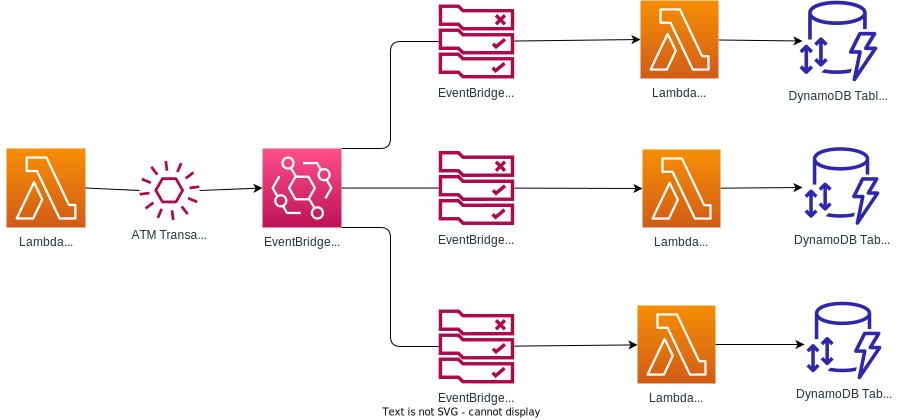

# AWS EventBridge Rule Prototype


This prototype use EventBridge to filter ATM transactions and depending on the EventBridge rule that is invoked it will put the transaction into different Dynamodb tables.  



The Terraform creates:
- A Lambda function that produces ATM transaction events and sends them to EventBridge
- Three Lambda functions that consume ATM transaction events and send them to the one of the three DynamoDB table
- Three DynamoDB tables to store the ATM transaction events
- Three rules on the default event bus that invoke one of the three consumer Lambda functions based on the ATM transaction details
- A file called `./scripts/variables.sh` which is created by Terraform and creates the variables used by the scripts


## Setup Prerequisites

- An AWS account 
- AWS CLI installed
- Terraform 5.0 or greater installed
- Node 14.17.0 or greater installed if you want to modify the Lambda functions


## Steps to run the Prototype

1. Run the Terraform to create the infrastructure.
    ``` bash
    $ terraform init
    $ terraform apply
    ```
2. Generate Event data 
    ``` bash
    $ cd scripts
    $ ./produce-events.zsh
    {
    "StatusCode": 200,
    "ExecutedVersion": "$LATEST"
    }
    ```
3. Verify the event results
    ``` bash
    $ ./verify-events.zsh 
    Success! ApprovedTransactions count is 2
    Success! NewYorkTransactions count is 2
    Success! FailedTransactions count is 1
    ```
4. If you want to delete the infrastructure, run the Terraform destroy command
    ``` bash
    $ terraform destroy
    ```

## Run the Lambda function locally
You can run the producer Lambda function locally to test it.  

1. Install the pre-requisites to run the Node Lambda function locally
    ``` bash
    $ cd src/producer
    $ npm install
    ```
2. Run the lambda function locally
    ``` bash
    $ node run-local.js
    ```

3. Cleanup the local node modules
    ``` bash
    $ rm -rf node_modules
    ```


## References

This prototype is based on the [sample application AWS EventBridge tutorial](https://docs.aws.amazon.com/eventbridge/latest/userguide/eb-tutorial-get-started.html).